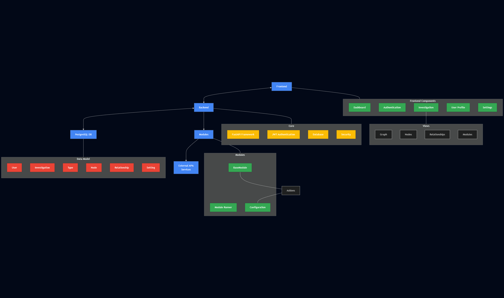

# OSFiler Architecture Documentation

## Project Overview

OSFiler is an OSINT (Open Source Intelligence) profiling tool designed for educational purposes. It creates comprehensive profiles of subjects (people, organizations, etc.) by collecting and linking various data points using a graph-based approach.

## System Architecture

### High-Level Architecture



### Component Breakdown

1. **Frontend**
   - React with TypeScript
   - Main components:
     - Dashboard
     - Authentication
     - Investigation
     - User Profile
     - Settings
   - Investigation views:
     - Graph visualization
     - Nodes management
     - Relationships management
     - Modules execution

2. **Backend API**
   - Core components:
     - FastAPI Framework
     - JWT Authentication
     - Database integration
     - Security mechanisms
   - Handles all API requests and data operations

3. **Database**
   - PostgreSQL database
   - Data model entities:
     - User
     - Investigation
     - Type
     - Node
     - Relationship
     - Setting

4. **Module System**
   - Base components:
     - BaseModule (abstract class)
     - ModuleRunner (execution engine)
     - Configuration management
   - Addon modules (dynamically loaded)
   - Connects to external APIs and services

## Data Model

### Core Entities

1. **User**
   - id: UUID
   - username: String (unique)
   - email: String (optional, unique)
   - full_name: String (optional)
   - password_hash: String
   - is_admin: Boolean
   - is_active: Boolean
   - created_at: DateTime
   - last_login: DateTime (optional)

2. **Investigation**
   - id: UUID
   - title: String
   - description: String (optional)
   - created_by: UUID (User ID)
   - created_at: DateTime
   - updated_at: DateTime
   - is_archived: Boolean
   - tags: String Array

3. **Type**
   - id: UUID
   - value: String
   - entity_type: Enum (node or relationship)
   - description: String (optional)
   - created_at: DateTime
   - updated_at: DateTime
   - is_system: Boolean

4. **Node**
   - id: UUID
   - investigation_id: UUID (Investigation ID)
   - type: String (references Type)
   - type_id: UUID (optional, Type ID)
   - name: String
   - data: JSON (type-specific data)
   - created_at: DateTime
   - updated_at: DateTime
   - created_by: UUID (optional, User ID)
   - source_module: String (optional)

5. **Relationship**
   - id: UUID
   - investigation_id: UUID (Investigation ID)
   - source_node_id: UUID (Node ID)
   - target_node_id: UUID (Node ID)
   - type: String (references Type)
   - type_id: UUID (optional, Type ID)
   - strength: Float (0.0 to 1.0)
   - data: JSON (type-specific data)
   - created_at: DateTime
   - updated_at: DateTime
   - created_by: UUID (optional, User ID)
   - source_module: String (optional)

6. **Setting**
   - key: String (primary key)
   - value: JSON
   - description: String (optional)
   - updated_at: DateTime

### Type System

The system includes a type management system for both nodes and relationships:

**Node types include:**
- PERSON
- ORGANIZATION
- USERNAME
- EMAIL
- PHONE
- ADDRESS
- WEBSITE
- SOCIAL_PROFILE
- DOCUMENT
- IMAGE
- LOCATION
- EVENT
- CUSTOM

**Relationship types include:**
- KNOWS
- OWNS
- WORKS_AT
- MEMBER_OF
- LOCATED_AT
- CONNECTED_TO
- RELATED_TO
- HAS_USERNAME
- HAS_EMAIL
- HAS_PHONE
- HAS_ADDRESS
- PARTICIPATED_IN
- CREATED
- VISITED
- CONTACTED
- FAMILY_OF
- FRIEND_OF
- COLLEAGUE_OF
- CUSTOM

## Module System

### Core ModuleRunner

The ModuleRunner is responsible for loading, managing, and executing modules. It provides a standardized interface for all modules to integrate with the system.

### Module Interface

Each module must implement a standard interface by extending the BaseModule class:

```python
class BaseModule:
    """Base class for all modules."""
    
    def __init__(self):
        """Initialize the module."""
        self.name = self.__class__.__name__.lower()
        self.display_name = self.name.replace('_', ' ').title()
        self.description = "Module description not provided"
        self.version = "0.1.0"
        self.author = "Unknown"
        self.required_params = []
        self.optional_params = []
        self.category = "uncategorized"
        self.tags = []
        self.db = None
        self.user_id = None
        self.config = {}
        self.load_config()
    
    def execute(self, params):
        """Execute the module with the given parameters."""
        raise NotImplementedError("Module must implement execute method")
    
    # Helper methods
    def validate_params(self, params):
        """Validate module parameters."""
        # Check required parameters
        for param in self.required_params:
            param_name = param["name"]
            if param_name not in params:
                raise ValueError(f"Missing required parameter: {param_name}")
        return True
    
    def create_node_data(self, node_type, name, data=None, source_module=None):
        """Create standardized node data structure."""
        return {
            "type": node_type,
            "name": name,
            "data": data or {},
            "source_module": source_module or self.name
        }
    
    def create_relationship_data(self, source_node_id, target_node_id, relationship_type,
                               strength=0.5, data=None, source_module=None):
        """Create standardized relationship data structure."""
        return {
            "source_node_id": source_node_id,
            "target_node_id": target_node_id,
            "type": relationship_type,
            "strength": strength,
            "data": data or {},
            "source_module": source_module or self.name
        }
    
    # Configuration methods
    def load_config(self):
        """Load module configuration from the database."""
        # Implementation details omitted for brevity
    
    def save_config(self, config):
        """Save module configuration to the database."""
        # Implementation details omitted for brevity
```

## API Endpoints

OSFiler exposes a comprehensive REST API for frontend interaction. The main endpoint categories are:

### Authentication
- Login, registration, user information, password management

### Investigations
- CRUD operations, archiving, search, import/export

### Nodes
- CRUD operations, search, relationships, graph data

### Relationships
- CRUD operations, relationship verification

### Types
- CRUD operations for node and relationship types

### Modules
- List, execute, configure modules

### System
- Health checks, settings management

## Security Considerations

1. **Authentication**: JWT-based authentication with token expiration
2. **Authorization**: Role-based access control for admin features
3. **Input Validation**: Strict validation of all user input
4. **Database Security**: Parameter binding to prevent SQL injection
5. **CORS Configuration**: Proper CORS policies to restrict domain access
6. **Password Hashing**: Secure password hashing with bcrypt
7. **Rate Limiting**: API rate limiting to prevent abuse
8. **HTTPS**: Support for secure HTTPS connections in production

## Deployment Considerations

1. **Containerization**: Docker containers for easy deployment
2. **Environment Variables**: Externalized configuration via environment variables
3. **Database Backups**: Regular database backups for data integrity
4. **Monitoring**: Application health monitoring and logging
5. **Scalability**: Horizontal scaling support for increased traffic